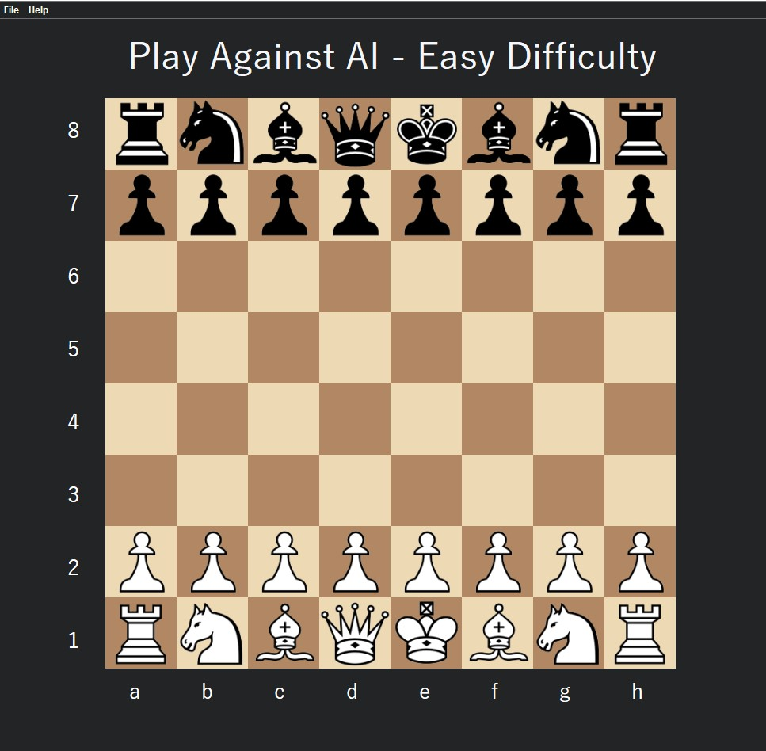

# Chess Tutor

The Tutor
----------

 - Personal chess tutor that can teach anyone how to play chess.
 - Three main sections in the application
 
    - Fundamental Lessons
    - Play Against AI
    - Chess Puzzles
    
  - Offers lessons suitable for both beginners and intermediate players but can also offer insight to advanced chess players.

Features
---------

 - Three AI difficulties:

    - Easy -- Simple RNG
    - Medium -- More advanced RNG
    - Hard -- More aggressive version of medium AI
   
 - Each lesson contains a scenario where the user can practice the concept taught
     - Lesson scenarios do not include AI but user can play against AI in play against AI section.
  
 - Puzzles contains checkmate puzzles (checkmate in 1,2 or 3 steps)
 - Quality of life features included: Highlighting clicked piece, display of possible moves
 - Custom font
 - Various screens such as start screen and AI settings screen

How to run
-----------
Run ChessTutorApplication.java to start
 
Previews
--------

